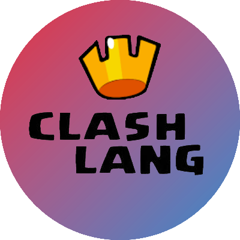

# Introducing *ClashLang*
## The programming language for clash royale enthusiasts

Have you ever wanted to try coding but were put off by the lack of *Clash Royale* references in mainstream programming languages?

No? 

Shut up, I don't remember asking.

Anywho, here's a programming language with syntax based on *clash royale* terminology:
```
do rocket bait deck with xbow
    witch defends giant
    predict xbow        // Hehehehaw 😂
    golem ignores sparky
    sparky kills giant
    elixir for arrows
    cycle arrows
        play skarmy
        skarmy kills golem  // Grrrr 😠
        cycle skarmy
            xbow defends sparky
            nerf skarmy
        gg
        nerf arrows
        sparky ignores witch
    gg
ez
```
> Parse an ASCII encoded string as an integer

# The Basics

Java, C++, Rust, they all have these dumb brackets and stuff like `{`? and `()`?? I mean it's an abomination. Even Python which is like supposed to be chill or something has the same `*` `+=` `--` `>=` `~` bs. And all of this code is littered with stupid, unreadble numbers. Like someone explain to me what `8` is?

Now on the other hand, if you say `golem`, I immediately know how much elixir we're talking about. Same with `bandit`, `pekka`, `ewiz`, `log`, `skarmy`, `princess`, `miner`, `arrows`, `valk`, `hunter`, `marcher`, `tesla`, `fireball`, `loon`, `giant`, `witch`, `prince`, `sparky`, `xbow`, `golem`, `rocket`, `zap`, `knight`, and `bomber`. These are all of the cards you can refence and they are all worth their elixir cost.

Now admittedly, we sometimes need numbers outside the 1-9 range, so all of these cards are able to hold any number, integer or decimal. Specifically, their value is represented by a JavaScript `Number`, a double-precision float equivalent to C's `double` or Rust's `f64`.

Of course you can't just set cards to ugly number literals. Instead, you can derive any number you need by interacting with a card or having cards interact with each other. The posible interactions are as follows:
| Interaction              | Effect                                 | Equivalent ugly code 🤮 |
|--------------------------|----------------------------------------|------------------------|
| buff <card>              | Card's value is incremented            | `card++`               |
| nerf <card>              | Card's value is decremented            | `card--`               |
| predict <card>           | Card's value is zeroed                 | `card = 0`             |
| <card1> defends <card2>  | Card2's value is added to Card1        | `card1 += card2`       |
| <card1> kills <card2>    | Card2's value is subtracted from Card1 | `card1 -= card2`       |
| <card1> ignores <card2>  | Card2's value is multiplied to Card1   | `card1 *= card2`       |
| <card1> counters <card2> | Card2's value is divided from Card     | `card1 /= card2`       |

> Okay, so you have 24 pre-named variables to use?

No, they're cards. 

> Well 24 *cards* doesn't seem like enough for me. I have to rewrite the entire Widows operating system in ClashLang, and there's a lot of numbers to store.

Not to worry, my friend, there's plenty of room to spare.

# Extra Memory

If you've ever had to program with a whole set of numbers that you were unwilling to individually name, you've probably used an *array* or something. Y'know, usually looks something like this:
```
[81, 3.14, 17, -0, 999]
```
How ugly!

In ClashLang, we put this ugliness where it belongs: behind bars. Specifically, the `elixir` bar. The elixir bar usually holds up to ten drops of delicious, pink amoxicillin, but ClashLang's elixir bar holds ten arrays like so:
```
[ array, array, array, array, array, array, array, array, array, array ]
```
Ten arrays is too many, so we only work with one array at a time. We use `elixir` to keep track of which array we're working with. If we're at `3` `elixir`, we are working with the array `3`. To increase our `elixir`, just `save elixir`. To decrease elixir, `leak elixir`. Don't worry, you can't ever have less than 1 or more than 10.

When working with an array, we can't mess with it all willy-nilly. We are refined men of Clash. You can peer down if you must, but otherwise you can only add numbers by pushing them on top and remove them by popping them off the top. Here's all of the commands you can use (remember they all operate on our `elixir`'s array):
| Command | Effect | Don't even ❌ |
|---|---|---|
| play <card> | Pops the top number into card | `card = array.pop()` |
| spam <card> | Pushes card's value on top | `array.push(card)` |
| elixir for <card> | Sets card's value to the array's size | `card = array.length` |
| <card1> kites <card2> | Sets card1's value to the number at the position in card2d | `card1 = array[card2]` |

Do note that if you try to pop a value off an empty array or peek at a spot in the array that doesn't exist, you'll just get zero.

> Did you make this nonsensical array of arrays system to compensate for something?

I will peel your kneecaps off. Clash royale has an elixir bar, this is my best attempt to implement it as a memory layout. Now lets look at input and output.

# Input/Output

There are two main I/O commands. One for input and one for output, obviously.

For getting input, we `spectate`. Yeah, just write `spectate`. This will prompt the user for input. Each character the user types is pushed (onto the array correspoding to our `elixir` no doubt), until they hit the enter key. Each character is stored as its ASCII value, or as determined by JavaScript's `String.prototype.charCodeAt()` at least.

Popping the characters off the top will return them in reverse order, so you might imagine that the string is stored upside down. Deal with it.

Speaking of popping, we can only display characters we pop off the top of the array. To show our rad character to the user, we `emote`. If the top number isn't a valid ASCII code (integer from 0-255), I will make it one, be that through truncation, absolute valuation, modulation, intimidation, or even torture.

If you want to display multiple characters, you need to `emote` multiple times. `emote`'s just can't convey that much information. Here's a function to print a string that's stored "upside-down" in `elixir`'s array:
```
do giant beatdown deck
    predict skarmy
    nerf skarmy
    cycle giant
        buff skarmy
        giant kites skarmy
        save elixir
        spam giant
        leak elixir
    gg
    play log
    cycle skarmy
        nerf skarmy
        emote
    gg
ez
```
This function is complicated significantly by the fact that I wrote it before there existed any command to get the length of an array. I supose it's still useful if you have your string stored in an array with other stuff you don't want to display.

> But I just want to print this one card's value

Ugh, fine: `peek <card>`

# Control Flow

Not too much here. There's no if/else garbage that's for sure. If you want to do something multiple times, you gotta `cycle`. Any code betwee `cycle <card>` and `gg` will be repeated until the indicated card's value is zero.

If the card's value is zero to start, then the whole `cycle` block is skipped. If you want your "if" statement, `cycle` the card you want to test, and if it's non-zero the code inside the `cycle` block will run. Just be sure to `predict` it or something so you don't keep cycling.

# Functions!

If you were disappointed by the options for control flow, light your toes on fire for all I care. But I am proud of this function system. But please, we call them `deck`'s around here.

You've probably noticed that to explain how you do a deck, you start `do <deck name> deck`. `deck` names are two part, the main card and the deck type. There are three deck types to choose from, `bait`, `beatdown`, and `control`, for a total of 3 * 24 possible `deck` names (any of the 24 cards can be a main card). I was cool with when you could only store 3 decks, so 72 should be plenty.

If you want parameters, you're gonna say `do <deckname> deck with <card1>, <card2>, ...`. Here's where things get interesting. Inside a function, you can use all of the cards, *but they won't be the same ones as outside the deck*. What happens in the deck stays in the deck. If you make a `deck with giant`, `giant` will be whatever value the `deck` is ran with. Another card, like `princess` will be its default 3.

Memory functions and I/O still work normally, though, and `elixir` is always `elixir` no matter what `deck` you play.

If you want to return a value, you need to edit the cards provided to the deck. If the `deck with giant` modifies `giant` and I `run` it with, say, `skarmy`, `skarmy` will be the one modified.

Confused?

Good, here's a little example. It might seem weird at first, but it's definitely an intuitive, useful, and powerful system:
```
log bait deck with princess // Make a log bait deck that squares a card's value
princess ignores princess   // Multiply the card by itslef
ez                          // End the deck block (like gg)

peek witch              // 5, the default value of witch
run log bait with witch // Run the deck using witch
peek witch              // 25, its been squared!
peek princess           // 3, still the default value as functions don't use global registers
```

# A Little Cheat

If you want to make a basic "hello world" program, you need to get the ACII values for "H", "e", "l", "o" and so on. You can make numbers rather efficently using the default values and provided interactions (more so than BrainF-), but it does make bloat your code.

Ugh, fine, I guess I will allow you to use some non-clash-terminology to embed text data in a program. First, you ust `join` a `clan` like "*on edge*" (just type `join clan`) and you can `chat Hello, world!`. This will push the string into the array we're working with (again as indicated by our `elixir`). It will be "upside-down", like when you `spectate`.

Now we can use our string to our heart's content.

# Not on Punctuation

You've probably guessed that you can write comments with `//`. Anything on a line after a `//` will be ignored. You can use newlines to split your commands (and you can leave lines blank, of course), but you can also put multiple commands on one line seperated by a `,`, like
```
play log, emote
```
Any whitespace before the word on a line will be ignored, as will any whitespcae at the end (doesn't mean you should put any there).

Alright, I think we're done here.

# What's Next?

What, for ClashLang? I'm done with it. For now.

I started this project because I wanted to write a "real" program in a funny esolang. LOLCODE wasn't esoteric enough, and BrainF--- too much so. I thought the [Among Us](https://esolangs.org/wiki/Among_Us) language was a funny idea, but when I tried to start making a big program it became a little repetitive. Sure, `red sus` will always be funny, but it makes for uninteresting programs.

If only there were another meme-able mobile game that I knew well.

A quick search didn't yield any Clash Royale programming languages, so I realized I would have to do it myself. I wanted a language that had a unique design, funny and thematic syntax, interesting and nonrepetitive code, and could be used to write "real" programs. My first thought wasn't perfect, but my second was alright and became the language you see here today.

> So is it really done?

I'll fix any obvious problems that may arise. And I will eventually write something real using this silly language. As for updating it, I've come up with some ideas.

Firstly, the array of arrays system is weird. It was just an attempt to be different than all the cell-based, stack-based, and 2d-grid-based esolangs. I also missed that `play`ing a card could drop your `elixir`. Or maybe you can only use certain cards when you're `elixi` is at a certain level. I did want to limit which cards can interact in which ways. Like `witch` wouldn't really ignore `golem`. And `giant` certainly can't kill `rocket`. But I was too lazy, and thus your "gameplay" can look pretty unrealistic. Also I got a lot farther than like LOLCODE, but it's still just a translation of any other programming language. I don't know if you could give it a radically different approach or not. I think it's fine. There's some clutter to clean up and plenty of unused clash terms out there.

If anyone wants, feel free to make a better version. Just note that it should technically be version 3, as this is really version 2. Finding version 1 is left as an excercise to the reader.

Speaking of excercises for the reader, how about you get up and actually do something gee whiz.
